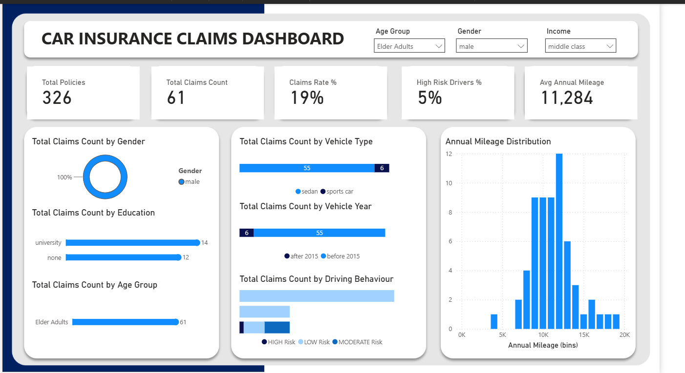
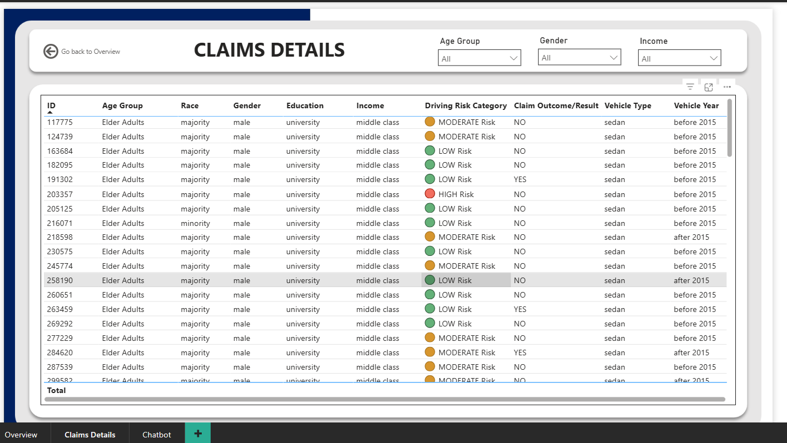
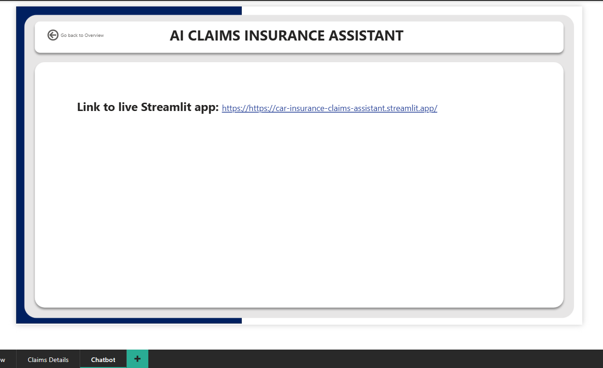

# Car Insurance Claims Analytics Assistant

Streamlit chatbot for the **Car Insurance Claims PowerBI Dashboard** topic. The app reads the local `Car_Insurance_Claim.csv` file, computes claim-risk summaries, and uses Gemini from backend configuration only.
The chatbot can be questioned in plain English related to dataset and then provides structured answers wih reasoning for results obtained!

- Live chatbot link: https://car-insurance-claims-assistant.streamlit.app/

## Setup

1. Create or update `.env` in this folder:

```env
GEMINI_API_KEY=your_key_here
```

`GOOGLE_API_KEY=your_key_here` also works if that is the name you already used.

Optional: force one or more models with a comma-separated fallback list:

```env
GEMINI_MODEL=gemini-2.5-flash-lite,gemini-2.5-flash
```

If Google returns a quota/model error, the app now shows a friendly message instead of crashing. Try again later, use a key with available quota, enable billing/quota in Google AI Studio, or change `GEMINI_MODEL` to a model available for your key.

2. Install dependencies:

```powershell
pip install -r requirements.txt
```

3. Run the app:

```powershell
streamlit run app.py
```

## Good questions

- What is the overall claim rate and why does it matter?
- Which age group has the highest claim rate?
- How do past accidents affect claim risk?
- Which income segment looks riskiest?
- Compare claim risk by vehicle year.
- Give me 3 business recommendations from this data.

## PowerBI Dashboard Screenshots

1. Landing Page



2. Drillthorugh of Claims Details for Education Column (based on above screenshot)



3. AI Car Insurance Claims Assistant Link



## License

See [LICENSE](LICENSE.txt) 
